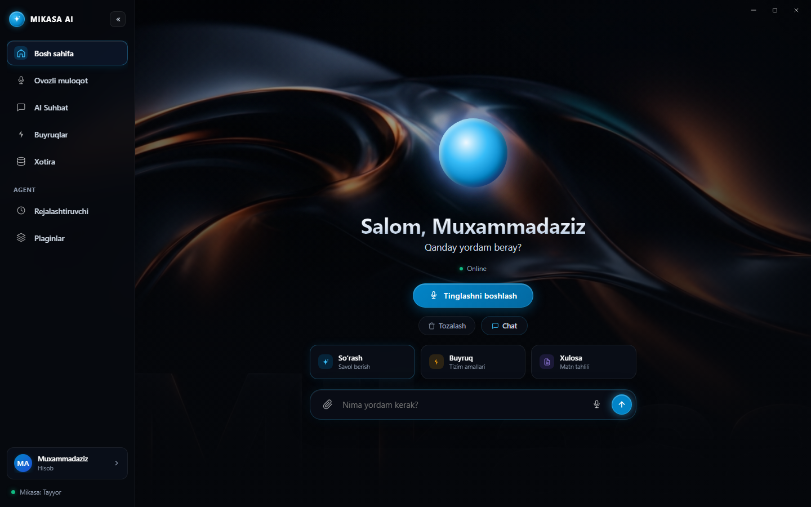
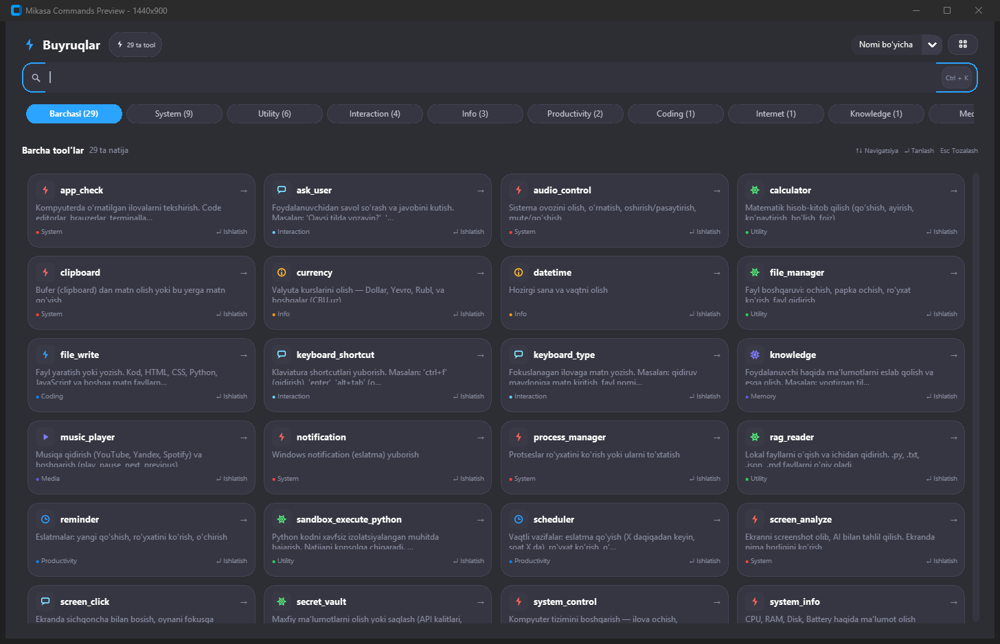
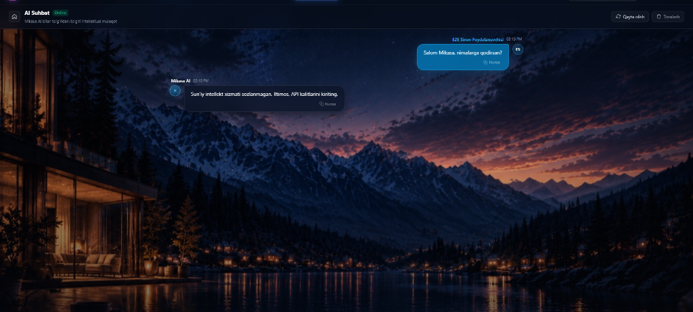
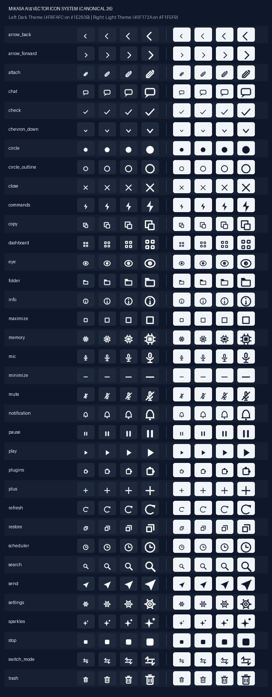

# 🔷 MIKASA AI v8.0.0 — Level 8 Autonomous Desktop Assistant & Intelligence Hub

> **O'zbek tilidagi birinchi professional avtonom AI desktop yordamchisi va aqlli orkestratori**  
> React 19 + Tauri 2.0 zamonaviy interfeysi, Supabase Auth xavfsiz autentifikatsiyasi, Ed25519 kriptografik PC Agent Enrollment & Pairing (Phase 42), Telegram masofaviy boshqaruvi, Wake-on-LAN, ko'p bosqichli intellektual boshqaruv (Agent Loop 2.0), Tool System 2.0 va to'liq avtonom xavfsiz auto-update (Phase 48) tizimi.

[](https://www.python.org/)
[](mikasa-7/)
[](https://microsoft.com/windows)
[](https://github.com/Muxammadaziz-boss/Mikasa.ai/releases/tag/v8.0.0)
[](tests/)

---

## 📸 Ilovaning Haqiqiy Interfeysi (Visual Showcase)

### 🪐 1. Bosh Sahifa va Interaktiv Mikasa Orb
*Haqiqiy vaqt rejimida yordamchi holatini ko'rsatuvchi vizual yadro, jonli telemetriya, tezkor AI harakatlari va ovozli boshqaruv.*


---

### ⚡ 2. Buyruqlar Markazi — 29+ Tizim Vositalari (Tool System 2.0)
*Klaviatura orqali tezkor boshqaruv (`Ctrl+K`), tizim asboblarini toifalash, interaktiv parametrlar va xavfsiz ijro.*


---

### 💬 3. Intellektual AI Suhbat va Zamonaviy Glassmorphism
*Fikrlovchi Gemini modellari, ko'p qatorli yozish maydoni, kontekstni to'liq saqlash va silliq aero-shisha vizual effektlari.*


---

### 🎨 4. Quiet Intelligence — Maxsus Vektor Ikonkalar Tizimi
*Matnli emojilardan butunlay xoli, 26 ta kanonik SVG piktogrammalar va premium qora dizayn karkasi.*


---

## 🌟 8-Versiyadagi Asosiy Yangiliklar (v8.0.0 / Phases 35–48)

Mikasa AI 8.0.0 versiyasi — loyiha tarixidagi eng yirik pog'ona bo'lib, avvalgi lokal dasturni **to'liq tarmoqlangan, masofadan boshqariluvchi, kriptografik xavfsiz va avtonom yangilanuvchi operatsion tizim yordamchisiga** aylantirdi:

### 1. 🔐 Supabase Auth & Multi-Tenant Xavfsizlik (Phase 40–41)
* **Yagona Identity Provider**: `auth.users.id` orqali xavfsiz email/parol, email tasdiqlash, parol tiklash va sessiyalar boshqaruvi.
* **Qat'iy RLS (Row Level Security)**: Har bir foydalanuvchining shaxsiy ma'lumotlari (`profiles`, `devices`, `sessions`, `tokens`) ma'lumotlar bazasi darajasida to'liq izolyatsiya qilingan.

### 2. 💻 Kriptografik PC Agent Enrollment & Pairing (Phase 42–44)
* **6-Xonali Qisqa Muddatli Kodlar**: 5 daqiqalik TTL, salt+hash himoyasi va bruteforce cheklovi (maksimal 5 ta xato urinish).
* **Ed25519 Asimmetrik Kriptografiya**: Agent shaxsiy kaliti OS darajasida (Windows DPAPI) shifrlanadi, serverga faqat ochiq kalit uzatiladi.
* **Challenge-Response Autentifikatsiyasi**: 32-bayt bir martalik tasodifiy nonce yordamida replay hujumlaridan to'liq kafolatlangan himoya.

### 3. 🌐 Telegram Webhook Gateway & Masofaviy Boshqaruv (Phase 38–39)
* **Universal Telegram Bot**: Dunyoning istalgan nuqtasidan kompyuterga xavfsiz buyruqlar yuborish, status olish, ekranni kuzatish va xabardor bo'lish.
* **Wake-on-LAN (WoL)**: Magic packet texnologiyasi va retry mexanizmi orqali uxlab yotgan yoki o'chiq kompyuterni masofadan uyg'otish.

### 4. 🛡️ Windows Agent & Qat'iy Sandboxlangan Tizim Vositalari (Phase 45–47)
* **Xavfsiz Ijro Sandboxi**: Tizim fayllarini (`C:\Windows`, `.ssh`, `.env`, parollar) himoya qiluvchi qat'iy PathSecurityValidator.
* **Haqiqiy Desktop Asboblar**: Screenshot olish, ilovalarni xavfsiz ishga tushirish/yopish, klaviatura/sichqoncha boshqaruvi, audio balandligi va resurslar auditi.

### 5. 🔄 Secure Auto-Update & Crash-Safe Rollback Engine (Phase 48)
* **SemVer 2.0.0 Qoidalari**: Versiyalarni qat'iy semantik taqqoslash (8.0.0 -> 8.1.0).
* **Ed25519 + SHA-256 Verifikatsiyasi**: Har bir yangilanish fayli serverdan yuklanishi bilanoq raqamli imzo va xesh orqali tekshiriladi; noto'g'ri yoki buzilgan fayl darhol rad etiladi (fail-closed).
* **Atomik Staging & Avtomatik Rollback**: Yangilanish jarayonida nosozlik yuz bersa, dastur o'zining avvalgi ishchi holatiga avtomatik qaytadi.

### 6. 🧠 Agent Loop 2.0 & Rejalashtirish Dvigateli (Planner)
* **Deterministik Sikl**: Har bir murakkab topshiriq `PLAN → ACT → OBSERVE → VERIFY → COMPLETE` zanjiri bo'yicha ketma-ketlikda bajariladi.
* **Bog'liqliklar Grafigi (DAG)**: Ko'p bosqichli buyruqlar Kahn algoritmi asosida topologik saralanadi.

---

## 📦 Rasmiy Windows Relizlar (v8.0.0 — Latest)

| Fayl nomi | Tavsif | Hajmi | Yuklab olish |
| :--- | :--- | :--- | :--- |
| **`Mikasa-AI-v8.0.0.exe`** | O'rnatish talab qilmaydigan Portable Desktop ilova | **4.87 MB** | [Yuklab olish](https://github.com/Muxammadaziz-boss/Mikasa.ai/releases/download/v8.0.0/Mikasa-AI-v8.0.0.exe) |
| **`Mikasa-AI-Setup-v8.0.0.exe`** | Windows uchun NSIS qulay o'rnatuvchi paketi | **2.01 MB** | [Yuklab olish](https://github.com/Muxammadaziz-boss/Mikasa.ai/releases/download/v8.0.0/Mikasa-AI-Setup-v8.0.0.exe) |
| **`Mikasa-AI-v8.0.0.msi`** | Korporativ standart Windows MSI paketi | **2.70 MB** | [Yuklab olish](https://github.com/Muxammadaziz-boss/Mikasa.ai/releases/download/v8.0.0/Mikasa-AI-v8.0.0.msi) |
| **`run_portable.bat`** | Backend (18420-port) va Desktop ilovani bir bosishda ishga tushiruvchi skript | **1 KB** | [Yuklab olish](https://github.com/Muxammadaziz-boss/Mikasa.ai/releases/download/v8.0.0/run_portable.bat) |
| **`WebView2Loader.dll`** | Windows native runtime kutubxonasi | **0.15 MB** | [Yuklab olish](https://github.com/Muxammadaziz-boss/Mikasa.ai/releases/download/v8.0.0/WebView2Loader.dll) |
| **`version_manifest.json`** | Kriptografik imzolangan rasmiy versiya manifesti | **2 KB** | [Yuklab olish](https://github.com/Muxammadaziz-boss/Mikasa.ai/releases/download/v8.0.0/version_manifest.json) |

---

## 🚀 O'rnatish va Ishga Tushirish

### 1-usul: Tayyor Desktop Ilovani Ishlatish (Foydalanuvchilar uchun)
1. [GitHub Releases Sahifasidan](https://github.com/Muxammadaziz-boss/Mikasa.ai/releases/tag/v8.0.0) `Mikasa-AI-v8.0.0.exe` yoki `Mikasa-AI-Setup-v8.0.0.exe` ni yuklab oling.
2. Ilovani ikki marta bosib ishga tushiring — dastur darhol tayyor bo'ladi.

### 2-usul: Dasturchilar uchun (Manba kodi orqali)
```bash
# 1. Repozitoriyani klonlash
git clone https://github.com/Muxammadaziz-boss/Mikasa.ai.git
cd Mikasa.ai

# 2. Python 3.11 virtual muhiti
python -m venv .venv
.venv\Scripts\activate
pip install -r requirements.txt

# 3. Frontend (mikasa-7)
cd mikasa-7
npm install
npm run build
cd ..

# 4. Tizimni ishga tushirish
python main.py
```

---

## 📁 Loyiha Kataloglar Tuzilmasi (v8.0.0)

```
Mikasa.ai/
├── agent/                      # Phase 45–47: Windows Agent & Secure Tools Execution
│   ├── auth.py                 # Agent autentifikatsiyasi & Challenge-Response
│   ├── config.py               # Agent konfiguratsiyasi & DPAPI kalit saqlash
│   ├── heartbeat.py            # FSM holat mashinasi va jonli signallar
│   ├── lifecycle.py            # Agent hayot sikli boshqaruvi
│   ├── tools.py                # Xavfsiz tizim asboblari & PathSecurityValidator
│   └── transport.py            # Kriptografik imzolangan HTTP transport
├── core/                       # Intellektual yadro va backend xizmatlari
│   ├── v8/                     # Phase 35–48: Supabase Auth, UpdateService, Telegram Gateway
│   ├── intelligence/           # Agent Loop 2.0, Planner DAG, Verifier, PermissionEngine
│   ├── tools/                  # Tool System 2.0 (29+ tizim asboblari)
│   ├── api_server.py           # Mahalliy asinxron REST & WebSocket server (18420-port)
│   └── audio_service.py        # VAD va audio oqimlar boshqaruvi
├── docs/                       # Loyiha arxitekturasi, qo'llanmalar va rasmlar
│   └── assets/                 # README uchun yuqori sifatli UI skrinshotlar
├── mikasa-7/                   # Tauri 2.0 + React 19 Desktop UI
│   ├── src/                    # Zamonaviy React komponentlari (Orb, Dashboard, Chat)
│   ├── src-tauri/              # Rust Tauri 2.0 desktop qobig'i
│   └── dist/                   # Ishlab chiqarish uchun yig'ilgan statik fayllar
├── release/                    # Yig'ilgan desktop ilovalar arxivi
│   └── v8.0.0/                 # Rasmiy Setup, Portable va MSI reliz fayllari
├── tests/                      # 240+ dan ortiq avtomatlashtirilgan backend testlari
├── main.py                     # Asosiy tizim boshqaruvchisi
├── requirements.txt            # Python bog'liqliklari
├── SETUP.md                    # To'liq sozlash qo'llanmasi
└── README.md                   # Loyiha bosh sahifasi
```

---

## 🧪 Sifat Kafolati va Sinov Ko'rsatkichlari

Loyiha to'liq integratsion, kriptografik va yuklama testlari bilan qamrab olingan:
```bash
# 1. Backend testlari (242 ta test)
python -m unittest discover tests/ "test_*.py"

# 2. Xavfsiz avto-yangilanish testlari (31 ta test)
python -m unittest tests/test_v8_secure_updater.py

# 3. Frontend testlari (15 ta test)
cd mikasa-7 && npm test
```
* **Backend**: `242 / 242 PASS` (100% barqaror)
* **Frontend**: `15 / 15 PASS` (100% barqaror)
* **Kriptografiya**: Ed25519, SHA-256, DPAPI, Constant-time verification

---

## 📄 Litsenziya va Muallif

* **Muallif:** Muxammadaziz ([@Muxammadaziz-boss](https://github.com/Muxammadaziz-boss))
* **Litsenziya:** MIT License
