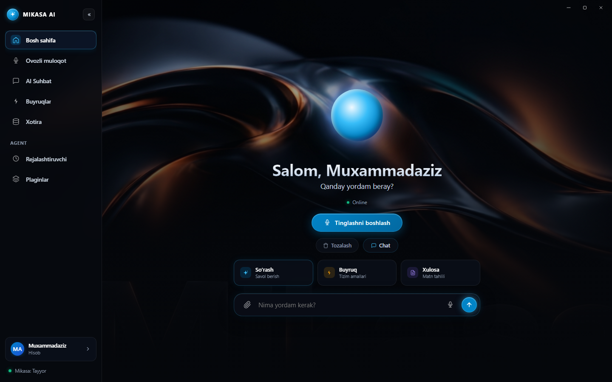
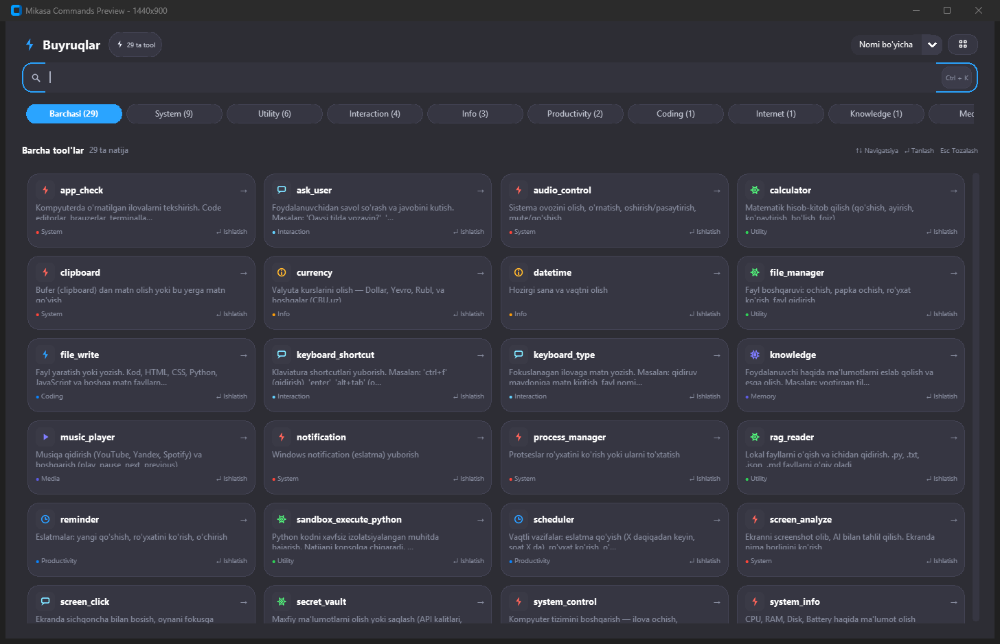
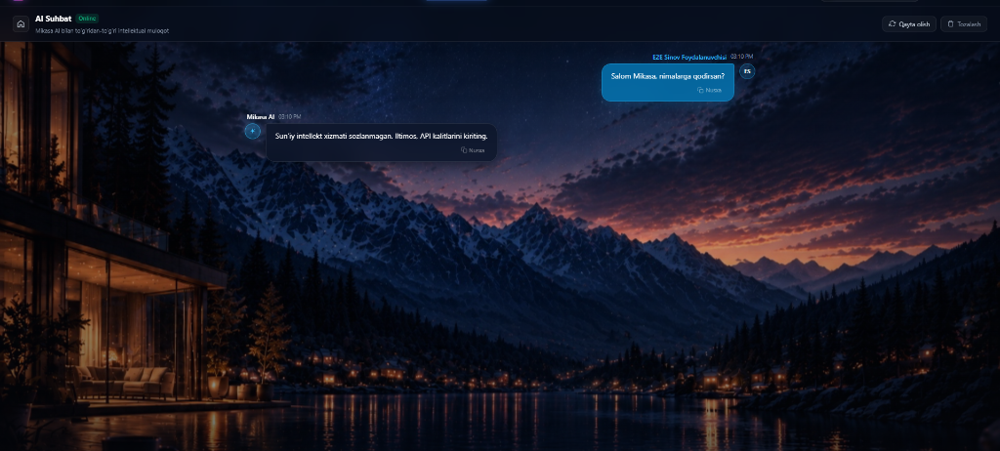
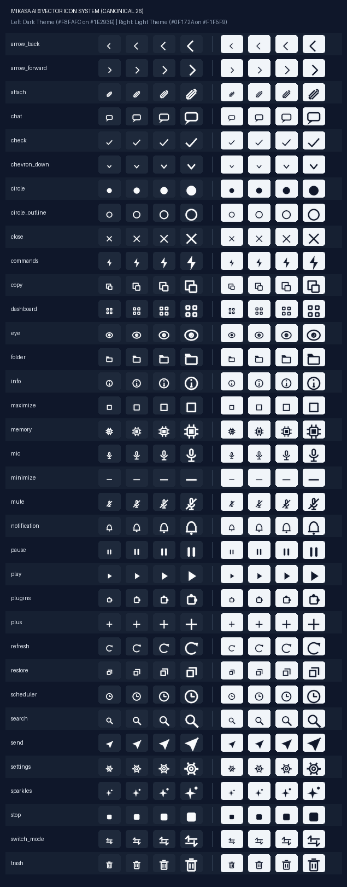

# 🔷 MISA AI (sobiq Mikasa AI) — Autonomous Desktop Assistant & Intelligence Hub

> **📢 MUHIM E'LON (v9.0.0 Rebranding): 9-versiyadan boshlab "Mikasa AI" loyihasi rasmiy ravishda "Misa" (`Misa AI`) deb yuritiladi!**  
> *1.0.0 dan 8.0.0 gacha bo'lgan barcha barqaror versiyalarda loyiha **Mikasa AI** nomi bilan ishlab chiqilgan va arxivlangan (`main` / `dev-v8.0.0`). **9.0.0 versiyadan (`dev-v9.0.0`) boshlab** loyiha yadrosi, desktop interfeysi (`Misa/`), ovozli chaqiruv tizimi ("Salom Misa"), Windows PC agenti va barcha hujjatlar **Misa AI** nomi ostida davom ettiriladi.*

> **O'zbek tilidagi birinchi professional avtonom AI desktop yordamchisi va aqlli orkestratori**  
> React 19 + Tauri 2.0 zamonaviy interfeysi, Supabase Auth ko'p foydalanuvchili (multi-tenant) xavfsiz autentifikatsiyasi, Google OAuth 2.0, Ed25519 kriptografik PC Agent Enrollment & Pairing, Universal Telegram Bot (`@Mikasa_ai_agent_bot`) orqali masofaviy boshqaruv, Wake-on-LAN, ko'p bosqichli intellektual boshqaruv (Agent Loop 2.0), Tool System 2.0 va Ed25519 imzolangan xavfsiz auto-update tizimi.

[](https://www.python.org/)
[](Misa/)
[](https://microsoft.com/windows)
[](https://github.com/Muxammadaziz-boss/Mikasa.ai/releases/tag/v8.0.0)
[-blueviolet)](https://github.com/Muxammadaziz-boss/Mikasa.ai/tree/dev-v9.0.0)
[](tests/)

---

## 🏷️ Loyiha Nomi Evolyutsiyasi: Mikasa AI ➔ Misa AI (v9.0.0+)

| Versiya davri | Rasmiy nom | Git Branch | Frontend Katalogi | Izoh |
| :--- | :--- | :--- | :--- | :--- |
| **v1.0.0 – v8.0.0** | **Mikasa AI** | `main`, `dev-v8.0.0` | `mikasa-7/` | 8-versiyagacha bo'lgan barcha relizlar va tarixiy arxitektura o'z holicha saqlanadi. |
| **v9.0.0 va undan keyin** | **Misa (`Misa AI`)** | `dev-v9.0.0` | `Misa/` | **9-versiyadan boshlab** barcha joyda **Misa** nomi qo'llaniladi. |

---

## 📸 Ilovaning Haqiqiy Interfeysi (Visual Showcase)

### 🪐 1. Bosh Sahifa va Interaktiv Misa Orb
*Haqiqiy vaqt rejimida yordamchi holatini (10 xil jonli holat: idle, listening, thinking, speaking, executing va h.k.) ko'rsatuvchi vizual yadro, jonli telemetriya, tezkor AI harakatlari va ovozli boshqaruv.*


---

### ⚡ 2. Buyruqlar Markazi — 29+ Tizim Vositalari (Tool System 2.0)
*Klaviatura orqali tezkor boshqaruv (`Ctrl+K`), tizim asboblarini toifalash, interaktiv parametrlar va xavfsiz ijro.*


---

### 💬 3. Intellektual AI Suhbat va Zamonaviy Glassmorphism
*Fikrlovchi Gemini va OpenRouter modellari, ko'p qatorli yozish maydoni, kontekstni to'liq saqlash, rasm generatsiyasi va silliq aero-shisha vizual effektlari.*


---

### 🎨 4. Quiet Intelligence — Maxsus Vektor Ikonkalar Tizimi
*Matnli emojilardan butunlay xoli, 26 ta kanonik SVG piktogrammalar va premium qora dizayn karkasi.*


---

## 🌟 8-Versiyadagi Barcha Yangiliklar va To'liq Arxitektura (v8.0.0 / Phases 35–48)

**8.0.0 versiyasi (`v8.0.0`)** — loyiha tarixidagi eng yirik arxitektura inqilobi bo'lib, avvalgi lokal desktop dasturni **to'liq bulut bilan sinxronlashgan, ko'p foydalanuvchili (multi-tenant), masofadan xavfsiz boshqariluvchi, kriptografik himoyalangan va avtonom yangilanuvchi operatsion tizim yordamchisiga** aylantirdi.

Quyida **8-versiyada amalga oshirilgan barcha bosqichlar (Phases 35–48) va xavfsizlik tizimlari** batafsil bayon qilingan:

### 1. 🌐 Masofaviy Boshqaruv Arxitekturasi & Wake-on-LAN (Phase 35–36)
* **Kriptografik `RemoteCommandEnvelope`**: Har bir masofaviy buyruq noyob `command_id` (UUID), bir martalik `nonce` va qat'iy yashash vaqti (`120s TTL`) bilan o'raladi; takroriy (replay) hujumlar avtomatik bloklanadi.
* **Wake-on-LAN (WoL) & `WakeRelay`**: UDP Magic Packet (`FF:FF:FF:FF:FF:FF` + 16x MAC manzil) va qayta urinish (retry) mexanizmi yordamida uxlab yotgan yoki o'chiq kompyuterni masofadan uyg'otish.
* **Qurilma Holati Mashinasi (`DeviceHeartbeatManager`)**: `ONLINE`, `STANDBY`, `SLEEPING`, `OFFLINE` holatlarini real vaqtda kuzatish va telemetriya (CPU, RAM, uptime) almashish.

### 2. 🔐 Masofaviy Sessiya Autentifikatsiyasi & Ruxsatlar Markazi (Phase 37–38)
* **`RemoteAuthSession` & 3 Darajali Ruxsat Profillari**:
  * `SAFE_READONLY` — faqat tizim holati, resurslar va skrinshotni ko'rish.
  * `STANDARD_CONTROL` — ruxsat berilgan ilovalarni ochish/yopish, sandbox ichida fayllar bilan ishlash.
  * `FULL_ADMIN` — quvvat boshqaruvi (`restart`, `shutdown`, `sleep`, `wake`) va to'liq tizim amallari.
* **15+ Masofaviy Agent Asboblari (`RemoteToolRegistry`)**: `system.status`, `system.info`, `system.screenshot`, `app.list`, `app.launch`, `app.close`, `file.list`, `file.read`, `file.write`, `file.delete`, `network.info`, `power.restart`, `power.shutdown`, `power.sleep`, `power.wake`.
* **Ikki Bosqichli Tasdiqlash (`ConfirmationToken`)**: Xavf darajasi yuqori bo'lgan amallar (kompyuterni o'chirish, qayta yuklash, fayl o'chirish) uchun 60 soniyalik bir martalik tasdiqlash tokeni talab etiladi.

### 3. 🤖 Universal Telegram Bot & OTP Hisob Bog'lash (Phase 39)
* **Yagona Ko'p Foydalanuvchili Bot (`@Mikasa_ai_agent_bot`)**: Bitta markaziy Telegram bot orqali barcha foydalanuvchilarga xizmat ko'rsatish; har bir foydalanuvchi faqat o'zining shaxsiy hisobi va kompyuterlarini boshqaradi.
* **6-Xonali OTP va Deep-Link (`?start=<token>`)**: Ilova ichidan bir bosishda yoki 6 xonali tasdiqlash kodi orqali Telegram hisobni bog'lash (`TelegramIdentityManager`).
* **Brute-Force Himoyasi**: Har bir Telegram foydalanuvchisi uchun 10 daqiqa ichida maksimal 5 ta noto'g'ri OTP urinish cheklovi va 10 daqiqada 3 ta kod generatsiya qilish limiti.
* **Boyitilgan Bot Buyruqlari**: `/start`, `/link <kod>`, `/unlink`, `/account`, `/devices`, `/select <qurilma>`, `/status`, `/pc`, `/access`, `/permissions`, `/revoke`, `/help`.

### 4. 🖥️ Multi-Device & Account Management 2.0 (Phase 40)
* **Ko'p Qurilmali Boshqaruv (`AccountDeviceManager`)**: Bitta hisobga bir nechta Windows kompyuterlarni (Uy kompyuteri, Ofis noutbuki, Server) ulash.
* **Faol Qurilmani Tanlash (`DeviceSelector`)**: Desktop/Web interfeysi yoki Telegram bot (`/select`) orqali joriy boshqarilayotgan kompyuterni tezkor almashtirish.
* **Qurilmalar Kesimida Izolyatsiya**: Har bir kompyuter uchun alohida sessiya, ruxsat profili va audit tarixi yuritiladi.

### 5. 🛡️ Supabase Auth, JWT Verifikatsiya & Multi-Tenant RLS (Phase 41 & 43)
* **Zero Backend Password Storage**: Backend server hech qachon foydalanuvchi parollarini saqlamaydi — ro'yxatdan o'tish, email tasdiqlash va parolni tiklash bevosita Supabase Auth (`auth.users`) orqali bajariladi.
* **Gibrid JWT Tekshiruvi (`SupabaseAuthManager`)**: Asimmetrik `ES256` / `RS256` (JWKS kesh bilan) hamda simmetrik `HS256` JWT tokenlarni kriptografik tekshirish.
* **Qat'iy Row Level Security (RLS)**: `public.profiles`, `public.devices`, `public.telegram_links`, `public.audit_logs` jadvallarida `auth.uid() = user_id` siyosati orqali foydalanuvchilar ma'lumotlari ma'lumotlar bazasi darajasida 100% izolyatsiya qilingan.
* **Tenant Spoofing Himoyasi**: JWT tokendagi foydalanuvchi ID si bilan `X-Mikasa-User-Id` / `user_id` so'rov parametrlari mos kelmasa, server darhol `403 Forbidden` qaytaradi.

### 6. 🔑 Kriptografik PC Agent Enrollment & Ed25519 Pairing (Phase 42)
* **6-Xonali Qisqa Muddatli Pairing Kodlar**: 5 daqiqalik TTL, `salt + SHA-256` xesh saqlash va brute-force himoyasi.
* **Ed25519 Asimmetrik Kalit Juftligi**: Kompyuter agenti o'zida Ed25519 yopiq/ochiq kalit juftligini yaratadi; yopiq kalit Windows DPAPI (`CryptProtectData`) orqali shifrlanib lokal vaultda saqlanadi, serverga faqat ochiq kalit yuboriladi.
* **Challenge-Response Autentifikatsiyasi**: 32-baytli kriptografik tasodifiy `nonce` imzolanishi orqali qurilma haqiqiyligi tekshiriladi va `DeviceSession` (`dsk_...`) tokeni beriladi.

### 7. 🔗 Google OAuth 2.0 & Barqaror State Lifecycle (Phase 44 + OAuth Fix)
* **Web va Desktop (Tauri) OAuth 2.0**: Tauri Desktop ilovasi uchun `127.0.0.1:1420` yordamchi listener va `127.0.0.1:18420` asosiy API server o'rtasida uzluksiz OAuth callback ko'prigi.
* **Pre-Registered OAuth State (`bad_oauth_state` yechimi)**: OAuth boshlanishidan oldin `state` parametri backendda oldindan ro'yxatga olinadi (`POST /api/auth/callback/session`), erta polling so'rovlarida `state` o'chib ketmasligi ta'minlanadi va `Access-Control-Allow-Private-Network: true` qo'llab-quvvatlanadi.
* **Identity Linking**: Mavjud email/parol hisobiga Google akkauntni ulash (`link`) va uzish (`unlink`), hamda bir Google hisobi ikki xil akkauntga ulanishining oldini olish (`409 Conflict`).

### 8. ⚙️ Mustaqil Windows PC Agent & Sandboxed Tool Execution (Phase 45–46)
* **Mustaqil Agent Xizmati (`agent/`)**: `AgentLifecycleManager`, `AgentHeartbeat`, `SecureTransport`, `CommandPoller` va `RemoteCommandExecutor` modullari.
* **`PathSecurityValidator` & Fayl Sandboxi**: Path traversal (`..`), UNC tarmoq yo'llari (`\\server\share`), Windows qurilma nomlari (`CON`, `NUL`, `COM1`), tizim papkalari (`C:\Windows`, `System32`, `AppData`, `.ssh`, `.gnupg`) va maxfiy fayllarni (`.env`, `id_rsa`, `*.key`, `*.pem`) qat'iy bloklash.
* **Xavfsiz Jarayon Boshqaruvi**: `eval()`, `exec()`, `os.system()` va `shell=True` butunlay taqiqlangan (AST testlar bilan nazorat qilinadi); faqat oq ro'yxatdagi ilovalar (`ALLOWED_APPS`) va himoyalangan tizim jarayonlari (`PROTECTED_PROCESSES`) filtrlanadi.

### 9. 🛡️ Full Agent Access & User Consent Security Center (Phase 47)
* **Explicit User Consent (Aniq Rozilik)**: Foydalanuvchi har bir qurilma uchun agentga to'liq vakolat berishdan oldin xavfsizlik ogohlantirishini tasdiqlaydi.
* **8 ta Vakolat Toifasi (`CAPABILITY_CATEGORIES`)**: Fayl tizimi, Ilovalar, Tizim ma'lumotlari, Ekran tasviri, Tarmoq, Quvvat boshqaruvi, Jarayonlar va Clipboard vakolatlarini alohida-alohida yoqish/o'chirish.
* **Emergency Revoke (Favqulodda Bekor Qilish)**: Desktop ilovadan yoki Telegram botdan (`/revoke`) birgina buyruq bilan barcha faol sessiyalarni, navbatdagi buyruqlarni va agent ruxsatlarini bir zumda to'xtatish.

### 10. 🔄 Secure Auto-Update & Crash-Safe Rollback Engine (Phase 48)
* **SemVer 2.0.0 Qoidalari**: Versiyalarni qat'iy semantik taqqoslash va downgrade hujumlaridan himoya.
* **Ed25519 + SHA-256 Verifikatsiyasi**: Har bir yangilanish fayli (`version_manifest.json` va `.exe` artefaktlar) serverdan yuklanishi bilanoq Ed25519 raqamli imzo va SHA-256 xesh orqali tekshiriladi; noto'g'ri imzoli fayl darhol o'chiriladi (fail-closed).
* **Atomik Staging & Avtomatik Rollback**: Yangilanish jarayonida xatolik yuz bersa, dastur avvalgi barqaror binar fayliga avtomatik qaytadi.

### 11. 🧠 Agent Loop 2.0, Standalone Backend Supervisor & Production Hardening
* **Agent Loop 2.0 (Planner DAG)**: Murakkab topshiriqlarni `PLAN → ACT → OBSERVE → VERIFY → COMPLETE` sikli va Kahn topologik saralash algoritmi asosida bajarish.
* **Self-Contained Desktop Runtime**: PyInstaller orqali yig'ilgan mustaqil `mikasa_backend.exe` Tauri Rust supervisor (`src-tauri/src/lib.rs`) tomonidan avtomatik ishga tushiriladi, sog'lig'i tekshiriladi (`/api/health`) va dastur yopilganda toza to'xtatiladi — foydalanuvchi kompyuterida Python yoki Node.js o'rnatilgan bo'lishi shart emas!
* **Production Xavfsizlik Middleware**: Cloud/Railway muhitida barcha himoyalangan endpointlar uchun majburiy `auth_enforcement_middleware` va qat'iy CORS siyosati.

---

## 📦 Rasmiy Windows Relizlar (v8.0.0 — Stable Archive)

> *Eslatma: v8.0.0 reliz fayllari tarixiy **Mikasa AI** nomi bilan imzolangan va chiqarilgan. v9.0.0 dan boshlab yangi relizlar **Misa AI** nomi ostida chiqariladi.*

| Fayl nomi | Tavsif | Hajmi | Yuklab olish |
| :--- | :--- | :--- | :--- |
| **`Mikasa-AI-Setup-v8.0.0.exe`** | ⭐ **Windows NSIS O'rnatuvchisi (Tavsiya etiladi)** | **2.01 MB** | [Yuklab olish](https://github.com/Muxammadaziz-boss/Mikasa.ai/releases/download/v8.0.0/Mikasa-AI-Setup-v8.0.0.exe) |
| **`Mikasa-AI-v8.0.0-Portable.zip`** | 📦 **To'liq Portativ Paket (Standalone Backend + DLL bilan)** | **18.2 MB** | [Yuklab olish](https://github.com/Muxammadaziz-boss/Mikasa.ai/releases/download/v8.0.0/Mikasa-AI-v8.0.0-Portable.zip) |
| **`Mikasa-AI-v8.0.0.exe`** | 🚀 **Mustaqil Portable Executable (Self-Contained)** | **4.90 MB** | [Yuklab olish](https://github.com/Muxammadaziz-boss/Mikasa.ai/releases/download/v8.0.0/Mikasa-AI-v8.0.0.exe) |
| **`Mikasa-AI-v8.0.0.msi`** | 🏢 **Standart Windows MSI Paketi** | **2.70 MB** | [Yuklab olish](https://github.com/Muxammadaziz-boss/Mikasa.ai/releases/download/v8.0.0/Mikasa-AI-v8.0.0.msi) |
| **`WebView2Loader.dll`** | ⚙️ **Windows Native Runtime Kutubxonasi** | **0.15 MB** | [Yuklab olish](https://github.com/Muxammadaziz-boss/Mikasa.ai/releases/download/v8.0.0/WebView2Loader.dll) |
| **`run_portable.bat`** | ⚡ **Backend va Desktop bir bosishda ishga tushiruvchi** | **1 KB** | [Yuklab olish](https://github.com/Muxammadaziz-boss/Mikasa.ai/releases/download/v8.0.0/run_portable.bat) |
| **`version_manifest.json`** | 🔐 **Kriptografik Imzolangan Rasmiy Manifest** | **2 KB** | [Yuklab olish](https://github.com/Muxammadaziz-boss/Mikasa.ai/releases/download/v8.0.0/version_manifest.json) |

---

## 🚀 O'rnatish va Ishga Tushirish

### 1-usul: Tayyor Desktop Ilovani Ishlatish (Foydalanuvchilar uchun)
1. **O'rnatuvchi orqali (Eng oson va tavsiya etilgan)**:  
   [Mikasa-AI-Setup-v8.0.0.exe](https://github.com/Muxammadaziz-boss/Mikasa.ai/releases/download/v8.0.0/Mikasa-AI-Setup-v8.0.0.exe) ni yuklab oling va ishga tushiring. O'rnatuvchi barcha kerakli kutubxonalarni avtomatik sozlaydi va ish stoli yorlig'ini yaratadi.
2. **Portativ rejimda (O'rnatmasdan)**:  
   [Mikasa-AI-v8.0.0-Portable.zip](https://github.com/Muxammadaziz-boss/Mikasa.ai/releases/download/v8.0.0/Mikasa-AI-v8.0.0-Portable.zip) yoki mustaqil [Mikasa-AI-v8.0.0.exe](https://github.com/Muxammadaziz-boss/Mikasa.ai/releases/download/v8.0.0/Mikasa-AI-v8.0.0.exe) ni yuklab olib, to'g'ridan-to'g'ri ishga tushiring.

### 2-usul: Dasturchilar uchun (Manba kodi orqali — v9.0.0 Misa AI)
```bash
# 1. Repozitoriyani klonlash va v9.0.0 (Misa) branchiga o'tish
git clone https://github.com/Muxammadaziz-boss/Mikasa.ai.git
cd Mikasa.ai
git checkout dev-v9.0.0

# 2. Python 3.11+ virtual muhiti
python -m venv .venv
.venv\Scripts\activate
pip install -r requirements.txt

# 3. Frontend (Misa — v9.0.0+)
cd Misa
npm install
npm run build
cd ..

# 4. Tizimni ishga tushirish
python main.py
```

---

## 📁 Loyiha Kataloglar Tuzilmasi (v9.0.0 — Misa AI)

```
Misa/ (yordamchi_9.0.0)
├── agent/                      # Phase 45–47: Windows PC Agent & Secure Tools Execution
│   ├── auth.py                 # Agent autentifikatsiyasi & Ed25519 Challenge-Response
│   ├── config.py               # Agent konfiguratsiyasi & DPAPI kalit saqlash
│   ├── executor.py             # Masofaviy buyruqlar ijrochisi va CommandPoller
│   ├── heartbeat.py            # FSM holat mashinasi va jonli signallar
│   ├── lifecycle.py            # Agent hayot sikli boshqaruvi
│   ├── tools.py                # 15 ta tizim asboblari & PathSecurityValidator
│   └── transport.py            # Kriptografik imzolangan HTTP transport
├── core/                       # Intellektual yadro va backend xizmatlari
│   ├── v8/                     # Phase 35–48: Supabase Auth, UpdateService, Telegram Gateway, OAuth
│   ├── intelligence/           # Agent Loop 2.0, Planner DAG, Verifier, PermissionEngine
│   ├── tools/                  # Tool System 2.0 (29+ lokal va tizim asboblari)
│   ├── api_server.py           # Asinxron REST & WebSocket server (18420-port)
│   └── audio_service.py        # VAD va audio oqimlar boshqaruvi
├── docs/                       # Loyiha arxitekturasi, qo'llanmalar va rasmlar
│   └── assets/                 # README uchun yuqori sifatli UI skrinshotlar
├── Misa/                       # v9.0.0+: Tauri 2.0 + React 19 Desktop UI (v8 da: mikasa-7/)
│   ├── src/                    # Zamonaviy React komponentlari (Orb, Dashboard, Chat, Auth)
│   ├── src-tauri/              # Rust Tauri 2.0 desktop qobig'i va Backend Supervisor
│   └── dist/                   # Ishlab chiqarish uchun yig'ilgan statik fayllar
├── packaging/                  # PyInstaller backend/agent bundler va Ed25519 reliz imzolash
├── release/                    # Yig'ilgan desktop ilovalar arxivi (v8.0.0+)
├── supabase/                   # Supabase PostgreSQL migratsiyalari va RLS siyosatlari
├── tests/                      # 240+ dan ortiq avtomatlashtirilgan backend va xavfsizlik testlari
├── main.py                     # Asosiy Misa AI tizim boshqaruvchisi
├── requirements.txt            # Python bog'liqliklari
├── SETUP.md                    # To'liq sozlash qo'llanmasi
└── README.md                   # Loyiha bosh sahifasi
```

---

## 🧪 Sifat Kafolati va Sinov Ko'rsatkichlari

Loyiha to'liq integratsion, kriptografik, multi-tenant RLS va yuklama testlari bilan qamrab olingan:
```bash
# 1. Backend testlari (242+ ta test)
python -m unittest discover tests/ "test_*.py"

# 2. Xavfsiz avto-yangilanish testlari (31 ta test)
python -m unittest tests/test_v8_secure_updater.py

# 3. Frontend testlari (15 ta test)
cd Misa && npm test
```
* **Backend**: `242 / 242 PASS` (100% barqaror)
* **Frontend**: `15 / 15 PASS` (100% barqaror)
* **Kriptografiya**: Ed25519, ES256/RS256 JWKS, SHA-256, Windows DPAPI, Constant-time verification

---

## 📄 Litsenziya va Muallif

* **Muallif:** Muxammadaziz ([@Muxammadaziz-boss](https://github.com/Muxammadaziz-boss))
* **Litsenziya:** MIT License
