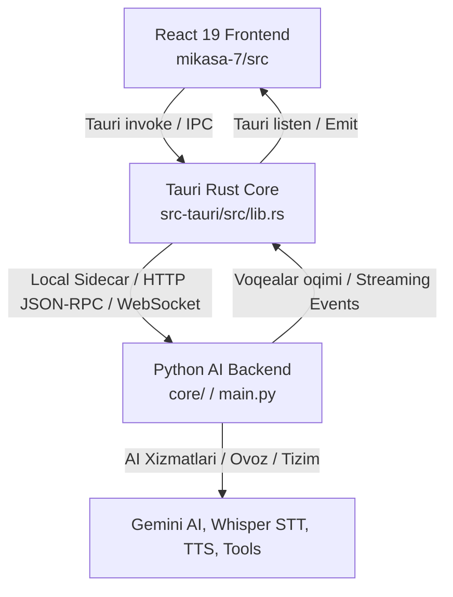

# MIKASA AI 7.0 — Desktop Architecture Document

Bu hujjat Mikasa AI 7.0 desktop poydevori, arxitektura tamoyillari, komponentlar iyerarxiyasi, aloqa strategiyasi (IPC) va bosqichma-bosqich migratsiya rejasini belgilaydi.

---

## 1. Loyihaning maqsad va arxitekturaviy ko'rinishi

Mikasa AI 6.0 CustomTkinter (Python) asosidagi to'liq ishlovchi ilova hisoblanadi. Mikasa AI 7.0 esa zamonaviy desktop arxitekturasi:
- **Desktop Shell**: **Tauri 2.x** (Rust asosida, yengil vaznli va xavfsiz)
- **Frontend UI**: **React 19 + TypeScript + Vite 8** (Deklarativ, reaktiv, 60fps silliq animatsiyalar)
- **AI Yadrosi va Backend**: **Python 3.12** (Mavjud `core/` moduli: Gemini AI, ovoz sintezi, STT, buyruqlar, xotira, plaginlar)

Ushbu yondashuv orqali Python-dagi barcha kuchli AI va tizim mantiqi saqlanib qoladi, grafik interfeys esa zamonaviy web-desktop texnologiyalari (CSS Tokens, Glassmorphism, Neon Glow) imkoniyatlaridan to'liq foydalanadi.

---

## 2. Kataloglar va Fayllar tuzilmasi

```
yordamchi_7.0.0/
├── core/                       # [Python] AI yadrosi, agent vositalari, audio, buyruqlar
├── gui/                        # [Python] Mikasa 6.0 CustomTkinter interfeysi (to'liq saqlanadi)
├── tests/                      # [Python] Mavjud va yangi testlar to'plami
├── mikasa-7/                   # [Yangi] Mikasa 7.0 Tauri desktop ilovasi
│   ├── src-tauri/              # Rust Tauri backend (Desktop oyna va tizim integratsiyasi)
│   │   ├── Cargo.toml          # Rust bog'liqliklari (tauri 2.x)
│   │   ├── tauri.conf.json     # Oyna parametrlari (1280x800, frameless, qorong'u rejim)
│   │   ├── capabilities/       # Tauri xavfsizlik ruxsatnomalari
│   │   └── src/
│   │       ├── lib.rs          # Tauri komandalar ro'yxatga oluvchi nuqtasi
│   │       └── main.rs         # Desktop ilovaning Rust kirish nuqtasi
│   ├── src/                    # React 19 + TypeScript frontend
│   │   ├── components/         # Atomik va molekulyar desktop komponentlar
│   │   │   ├── icons/Icons.tsx # Vektorli desktop SVG ikonkalari
│   │   │   ├── Avatar.tsx      # Profil boshqaruvi
│   │   │   ├── Button.tsx      # Birlamchi, ikkilamchi va shisha (glass) tugmalar
│   │   │   ├── IconButton.tsx  # Oyna va panel tugmalari
│   │   │   ├── MikasaLogo.tsx  # Mikasa brend logotipi
│   │   │   ├── MikasaOrb.tsx   # 7 holatli interaktiv AI sferasi (Orb)
│   │   │   ├── StatusIndicator.tsx # Tizim holati (Online/Offline)
│   │   │   └── WindowControls.tsx  # Ramkasiz oyna boshqaruvi (Min, Max, Close)
│   │   ├── layout/             # Ilova skeleti
│   │   │   ├── TopBar.tsx      # Drag region va oyna sarlavhasi
│   │   │   ├── Sidebar.tsx     # 2 darajali navigatsiya paneli (MIKASA va AGENT)
│   │   │   ├── AccountRow.tsx  # Pastki profil va sozlamalar qatori
│   │   │   └── AppShell.tsx    # Asosiy desktop freymi
│   │   ├── pages/              # Sahifalar
│   │   │   ├── LandingPlaceholder.tsx # Step 0 Bosh sahifa (AI Orb, Salomnoma, Voice CTA)
│   │   │   └── RoutePlaceholder.tsx   # Zaxira marshrut sahifalari
│   │   ├── styles/
│   │   │   ├── tokens.css      # Markazlashgan dizayn tokenlari
│   │   │   └── globals.css     # Desktop reset va global ko'rinish
│   │   ├── App.tsx             # Holatga asoslangan navigatsiya
│   │   └── main.tsx            # React render kirish nuqtasi
│   ├── package.json            # NPM bog'liqliklari
│   └── vite.config.ts          # Vite yig'uvchi konfiguratsiyasi
```

---

## 3. Dizayn tizimi va vizual yo'nalish

Mikasa 7.0 vizual tili **futuristik, xotirjam, intellektual va qorong'u (Dark-native)**:
- **Fon ranglari**:
  - Asosiy fon: `--bg-darkest: #07090E`
  - Panellar va kartochkalar: `--surface: #0E131F`, `--surface-card: #131A2B`
  - Shisha effekti: `--glass-bg: rgba(14, 19, 31, 0.65)` va `backdrop-filter: blur(20px)`
- **Aktsent va nurlar (Glow)**:
  - Birlamchi moviy: `--primary: #0284C7`, `--primary-glow: #38BDF8`
  - Kian neon: `--secondary: #06B6D4`
  - Binafsha/Aksent: `--accent: #8B5CF6`
- **Tipografika**:
  - Tizim shriftlari: `'Segoe UI', -apple-system, BlinkMacSystemFont, sans-serif`
  - Monospace (kod va parametrlar uchun): `'Consolas', 'Cascadia Code', monospace`
- **Oyna o'lchamlari**:
  - Boshlang'ich o'lcham: `1280 x 800`
  - Minimal o'lcham: `1024 x 700`
  - Ramkasiz (Frameless): Windows standart oq sarlavha paneli o'rniga maxsus ishlab chiqilgan `TopBar` va `WindowControls` ishlatiladi.
  - `data-tauri-drag-region` orqali sichqoncha bilan oynani sudrab siljitish ta'minlangan.

---

## 4. AI Orb (Ko'p holatli sfera) komponenti

Mikasa AI holatlarini ifodalovchi markaziy vizual yadro:
1. `idle` — Xotirjam nafas oluvchi sokin moviy-kian yorug'lik.
2. `listening` — Foydalanuvchi gapirayotganda kian-zumrad to'lqinlanuvchi pulsatsiya.
3. `thinking` — AI javob o'ylayotganda binafsha-moviy aylanuvchi energiya.
4. `speaking` — AI gapirayotganda yuqori faollikdagi dinamik nur tarqalishi.
5. `loading` — Tizim ishga tushayotgandagi progress aylanishi.
6. `error` — Xatolik yuz bergandagi qizg'ish ogohlantiruvchi nur.
7. `offline` — Tizim tarmoqdan uzilgandagi xira kulrang holat.

Animatsiyalar sof CSS (`@keyframes`) orqali GPU-da ishlaydi va kompyuter protsessoriga yuklama bermaydi (<1% CPU).

---

## 5. Aloqa strategiyasi (Tauri IPC va Python AI Backend)

Mikasa 7.0 da frontend va backend o'rtasidagi ma'lumotlar oqimi:



### Tavsiya etilgan aloqa kanallari:
1. **Tezkor buyruqlar va ma'lumot olish**: Tauri `invoke` orqali Python FastAPI/JSON-RPC yoki stdio sidecar-ga so'rov yuborish.
2. **Ovoz va matn oqimi (Streaming)**: WebSocket yoki Server-Sent Events (SSE) orqali so'zma-so'z javob qaytarish.
3. **Audio kirish/chiqish**: Mahalliy mikrofon oqimini Python STT drayveriga yuborish yoki Web Audio API orqali uzatish.

---

## 6. Ishga tushirish yo'riqnomasi

### Mikasa 6.0 (Mavjud CustomTkinter ilovasi):
```bash
# Virtual muhitni faollashtirish
& "d:\Ishchi stoli\Mikasa\.venv\Scripts\python.exe" run_gui.py
# yoki
& "d:\Ishchi stoli\Mikasa\.venv\Scripts\python.exe" main.py
```

### Mikasa 7.0 (Yangi Tauri ishchi stoli ilovasi):
```bash
cd mikasa-7
# Web rejimida ko'rish (brauzerda):
npm run dev

# To'liq desktop oynasida sinash:
npm run tauri dev

# Ishlab chiqarish paketini yig'ish:
npm run build
npm run tauri build
```

---

## 7. Kelgusi qadamlar (Step 1 va undan keyingi bosqichlar)

1. **Step 1: Python IPC & Tauri Bridge**:
   - Python backendni fon xizmati (sidecar yoki HTTP/WS) sifatida ishga tushirish mexanizmi.
   - Tauri orqali Python jarayoni (process lifecycle) hayotiy siklini boshqarish (start, health-check, graceful shutdown).
2. **Step 2: Real Landing Page integratsiyasi**:
   - Placeholder o'rniga Python yadrosidan olingan haqiqiy holat, tezkor harakatlar va so'nggi ma'lumotlarni ko'rsatish.
3. **Step 3: Chat va Streaming javoblar**:
   - To'liq AI suhbat sahifasi, kod bloklari sintaksisi va xabarlar tarixi.
4. **Step 4: Ovozli muloqot va real-vaqt to'lqinlari**:
   - MikasaOrb bilan sinxronlashgan real-vaqt ovoz vizualizatsiyasi.
